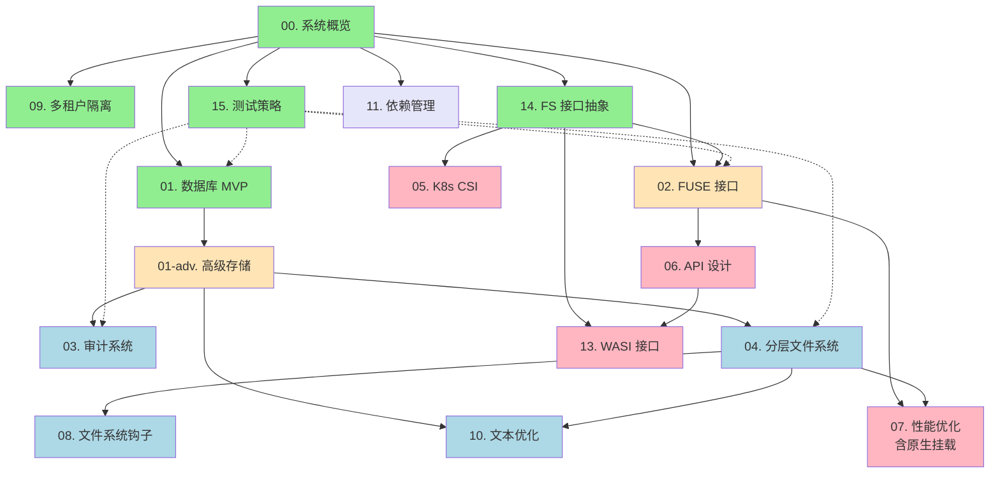

# Tarbox 技术规范文档

## 文档概述

本目录包含 Tarbox 项目的详细技术规范，描述系统的设计理念、架构决策和实现细节。每个规范文档关注特定的技术领域或功能模块。

## 规范组织结构

### 📐 核心架构规范 (P0 - 必须实现)

这些规范定义了 Tarbox 的核心架构和基础功能：

#### 00. 系统概览
- **文件**: [00-overview.md](00-overview.md)
- **状态**: ✅ 完成
- **内容**: 项目愿景、整体架构、设计哲学
- **关联任务**: All tasks
- **适合**: 新手入门、架构师

#### 01. 数据库 Schema 设计 (MVP)
- **文件**: [01-database-schema.md](01-database-schema.md)
- **状态**: ✅ MVP 完成
- **内容**: 核心表结构 - tenants, inodes, data_blocks
- **关联任务**: Task 02 ✅
- **适合**: 数据库开发、MVP 实现

#### 01-advanced. 高级存储特性
- **文件**: [01-advanced-storage.md](01-advanced-storage.md)
- **状态**: 📅 待实现
- **内容**: 高级表结构 - layers, text_blocks, audit_logs, native_mounts, snapshots, statistics
- **基于**: spec/01 (MVP核心)
- **关联任务**: Task 06 (审计), Task 08 (分层), Task 09 (文本优化)
- **适合**: 高级功能开发、性能优化

#### 02. FUSE 接口
- **文件**: [02-fuse-interface.md](02-fuse-interface.md)
- **状态**: 📅 待实现
- **内容**: FUSE 适配器实现、POSIX 映射、异步桥接
- **基于**: spec/14 (FilesystemInterface)
- **关联任务**: Task 05
- **适合**: 系统编程、文件系统开发

#### 09. 多租户隔离
- **文件**: [09-multi-tenancy.md](09-multi-tenancy.md)
- **状态**: ✅ 已实现 (数据库层)
- **内容**: 租户隔离机制、安全策略、资源限制
- **关联任务**: Task 02, Task 03, Task 04
- **适合**: 安全架构、多租户系统设计

#### 14. 文件系统接口抽象层
- **文件**: [14-filesystem-interface.md](14-filesystem-interface.md)
- **状态**: ✅ 规范完成，待实现
- **内容**: 统一的 FilesystemInterface trait、数据类型、错误映射
- **关联任务**: Task 05 (FUSE), Task 12 (CSI), Task 15 (WASI)
- **适合**: 接口设计、架构师
- **⭐ 重要**: FUSE/CSI/WASI 的共同基础

#### 15. 测试策略与覆盖率
- **文件**: [15-testing-strategy.md](15-testing-strategy.md)
- **状态**: ✅ 完成
- **内容**: 分层测试策略、Mockall 使用指南、80% 覆盖率实施路径
- **关联任务**: All tasks (横切关注点)
- **适合**: 所有开发者、QA
- **⭐ 重要**: 项目质量保证的核心指南

---

### 🔧 核心功能规范 (P1 - 高优先级)

这些规范定义了 Tarbox 的核心功能特性：

#### 03. 审计系统
- **文件**: [03-audit-system.md](03-audit-system.md)
- **状态**: 📅 待实现
- **内容**: 操作日志记录、时间分区、查询 API、合规报告
- **关联任务**: Task 06
- **适合**: 安全审计、合规管理

#### 04. 分层文件系统
- **文件**: [04-layered-filesystem.md](04-layered-filesystem.md)
- **状态**: 📅 待实现
- **内容**: COW 机制、层管理、检查点、快照
- **关联任务**: Task 08
- **适合**: 版本控制、容器技术

#### 08. 文件系统钩子
- **文件**: [08-filesystem-hooks.md](08-filesystem-hooks.md)
- **状态**: 📅 待实现
- **内容**: 虚拟 /.tarbox/ 目录、层控制命令、动态配置
- **关联任务**: Task 08
- **适合**: 用户交互、控制接口设计

#### 10. 文本文件优化
- **文件**: [10-text-file-optimization.md](10-text-file-optimization.md)
- **状态**: 📅 待实现
- **内容**: 行级存储、diff 算法、跨层去重
- **关联任务**: Task 09
- **适合**: 算法优化、存储效率

---

### 🚀 高级功能规范 (P2 - 后续实现)

这些规范定义了 Tarbox 的高级特性和云原生集成：

#### 05. Kubernetes CSI 驱动
- **文件**: [05-kubernetes-csi.md](05-kubernetes-csi.md)
- **状态**: 📅 待实现
- **内容**: CSI 规范实现、动态卷配置、快照管理
- **关联任务**: Task 12
- **适合**: Kubernetes 运维、云原生架构

#### 06. API 设计
- **文件**: [06-api-design.md](06-api-design.md)
- **状态**: 📅 待实现
- **内容**: REST API、gRPC API、认证授权、API 网关
- **关联任务**: Task 13, Task 14
- **适合**: API 开发、微服务架构

#### 07. 性能优化
- **文件**: [07-performance.md](07-performance.md)
- **状态**: 📅 待实现
- **内容**: 缓存策略、并发控制、查询优化、基准测试、原生文件系统挂载
- **包含**: 原 spec/12 (原生挂载) 已合并到本规范
- **关联任务**: Task 11
- **适合**: 性能调优、生产部署

#### 13. WASI 接口
- **文件**: [13-wasi-interface.md](13-wasi-interface.md)
- **状态**: ✅ 规范完成，待实现
- **内容**: WebAssembly 支持、边缘计算、浏览器集成
- **关联任务**: Task 15
- **适合**: 边缘计算、WebAssembly 开发

---

### 🔌 可选功能规范 (P3 - 可延后/替代)

这些规范定义了可选的优化特性：

#### 11. 依赖管理
- **文件**: [11-dependencies.md](11-dependencies.md)
- **状态**: ✅ 完成 (文档)
- **内容**: Cargo 依赖策略、安全审计、License 检查
- **关联任务**: Task 01 (已应用)
- **适合**: 项目维护、供应链安全

#### 12. 原生挂载
- **文件**: [12-native-mounting.md](12-native-mounting.md) → **已合并到 [spec/07](07-performance.md#原生文件系统挂载)**
- **状态**: 🔄 已合并到 spec/07 性能优化规范
- **内容**: 主机文件系统直通、性能优化、路径映射（见 spec/07）
- **替代方案**: 推荐使用 bubblewrap 在容器层实现
- **关联任务**: 可选
- **适合**: 性能优化、混合存储方案

---

## 规范依赖关系

**图例**:
- 🟢 绿色: 核心架构 (P0)
- 🟡 橙色: 核心功能 (P1)
- 🔵 蓝色: 高级功能 (P2)
- 🌸 粉色: 云原生 (P2)
- 🟣 紫色: 可选功能 (P3)

## 实现状态矩阵

| 规范 | 标题 | 优先级 | 设计 | 实现 | 测试 | 文档 |
|------|------|--------|------|------|------|------|
| 00 | 系统概览 | P0 | ✅ | ✅ | ✅ | ✅ |
| 01 | 数据库 Schema (MVP) | P0 | ✅ | ✅ | ✅ | ✅ |
| 01-adv | 高级存储特性 | P1 | ✅ | ⏳ | ⏳ | ✅ |
| 02 | FUSE 接口 | P0 | ✅ | ⏳ | ⏳ | ✅ |
| 03 | 审计系统 | P1 | ✅ | ⏳ | ⏳ | ✅ |
| 04 | 分层文件系统 | P1 | ✅ | ⏳ | ⏳ | ✅ |
| 05 | K8s CSI | P2 | ✅ | ⏳ | ⏳ | ✅ |
| 06 | API 设计 | P2 | ✅ | ⏳ | ⏳ | ✅ |
| 07 | 性能优化 (含原生挂载) | P2 | ✅ | ⏳ | ⏳ | ✅ |
| 08 | 文件系统钩子 | P1 | ✅ | ⏳ | ⏳ | ✅ |
| 09 | 多租户隔离 | P0 | ✅ | ✅ | ✅ | ✅ |
| 10 | 文本优化 | P1 | ✅ | ⏳ | ⏳ | ✅ |
| 11 | 依赖管理 | P3 | ✅ | ✅ | ✅ | ✅ |
| 12 | 原生挂载 → 已合并到 07 | P3 | ✅ | - | - | ✅ |
| 13 | WASI 接口 | P2 | ✅ | ⏳ | ⏳ | ✅ |
| 14 | FS 接口抽象 | P0 | ✅ | ⏳ | ⏳ | ✅ |
| 15 | 测试策略 | P0 | ✅ | 🔄 | 🔄 | ✅ |

**符号说明**:
- ✅ 完成
- 🔄 部分完成
- ⏳ 待开始
- ❌ 不适用

## 阅读路线

### 🎯 新手入门路线

对于刚接触 Tarbox 的开发者：

1. **[00. 系统概览](00-overview.md)** - 理解项目愿景和整体架构
2. **[09. 多租户隔离](09-multi-tenancy.md)** - 理解隔离模型
3. **[01. 数据库 Schema](01-database-schema.md)** - 理解数据模型
4. **[02. FUSE 接口](02-fuse-interface.md)** - 理解用户接口

### 💻 后端开发路线

对于专注后端存储的开发者：

1. **[01. 数据库 Schema (MVP)](01-database-schema.md)** - PostgreSQL 核心设计
2. **[01-advanced. 高级存储](01-advanced-storage.md)** - 分层、文本、审计表
3. **[04. 分层文件系统](04-layered-filesystem.md)** - COW 机制
4. **[10. 文本优化](10-text-file-optimization.md)** - 存储优化
5. **[07. 性能优化](07-performance.md)** - 性能调优

### 🔧 系统编程路线

对于专注文件系统实现的开发者：

1. **[02. FUSE 接口](02-fuse-interface.md)** - POSIX 映射
2. **[08. 文件系统钩子](08-filesystem-hooks.md)** - 控制接口
3. **[07. 性能优化](07-performance.md)** - 性能优化（包含原生挂载）
4. **[04. 分层文件系统](04-layered-filesystem.md)** - 版本控制

### ☸️ 云原生/DevOps 路线

对于专注部署和运维的开发者：

1. **[05. Kubernetes CSI](05-kubernetes-csi.md)** - K8s 集成
2. **[06. API 设计](06-api-design.md)** - REST/gRPC 接口
3. **[03. 审计系统](03-audit-system.md)** - 日志和合规
4. **[07. 性能优化](07-performance.md)** - 生产环境调优

### 🌐 边缘计算/WASM 路线

对于专注边缘计算的开发者：

1. **[13. WASI 接口](13-wasi-interface.md)** - WebAssembly 支持
2. **[06. API 设计](06-api-design.md)** - HTTP 客户端
3. **[01. 数据库 Schema](01-database-schema.md)** - SQLite 适配
4. **[07. 性能优化](07-performance.md)** - 边缘优化

## 技术决策记录 (ADR)

每个规范文档的末尾包含"决策记录"部分，记录关键的架构决策和原因。主要决策包括：

### DR-00: 使用 PostgreSQL 作为存储后端
- **原因**: ACID 保证、丰富生态、分布式支持
- **权衡**: 性能开销 vs 可靠性和功能

### DR-01: 采用内容寻址存储 (CAS)
- **原因**: 自动去重、完整性验证、跨层共享
- **实现**: BLAKE3 哈希算法

### DR-02: 线性层历史而非分支
- **原因**: 简化实现、明确状态、易于理解
- **权衡**: 灵活性 vs 复杂度

### DR-03: 文本文件行级存储
- **原因**: 高效 diff、跨文件去重、Git 风格
- **实现**: TextBlock + TextLineMap

### DR-12: 原生挂载使用 bubblewrap 替代
- **原因**: 单一职责、安全性、维护成本
- **方案**: 容器层实现而非文件系统内部

### DR-13: WASI 支持采用 HTTP Proxy 模式
- **原因**: 保持多租户、简化 WASM 模块、易于扩展
- **实现**: HTTP API + WASM 客户端

## 规范维护

### 更新原则

1. **设计先行**: 代码实现前，规范必须明确
2. **保持同步**: 实现变更时，及时更新规范
3. **版本控制**: 重大变更记录在版本历史中
4. **可追溯性**: 每个决策都有明确的原因

### 文档规范

- **标题结构**: 使用清晰的章节层次
- **代码示例**: 仅作说明，不是实现
- **图表**: 使用 Mermaid 或 ASCII art
- **术语**: 保持一致的技术术语

### 贡献指南

1. 提出问题或改进建议 (GitHub Issues)
2. Fork 仓库并创建分支
3. 修改规范文档
4. 提交 Pull Request
5. Code Review 和讨论
6. 合并到主分支

## 相关文档

- **任务文档**: [../task/](../task/) - 实现任务和进度
- **开发指南**: [../CLAUDE.md](../CLAUDE.md) - 代码规范
- **用户文档**: [../docs/](../docs/) - 使用指南
- **项目主页**: [../README.md](../README.md) - 项目介绍

## 更新日志

- 2026-01-17: 创建 spec/15 (测试策略与覆盖率)，定义 mockall 集成测试方案
- 2026-01-17: 拆分 spec/01 为 MVP 核心和高级存储（spec/01-advanced-storage.md）
- 2026-01-17: 合并 spec/12 (原生挂载) 到 spec/07 (性能优化)
- 2026-01-17: 创建 spec/14 (FilesystemInterface 抽象层)，更新 spec/02、05、13 引用
- 2026-01-17: 重组规范结构，添加依赖关系图和阅读路线
- 2026-01-16: 添加 spec 13 (WASI 接口)
- 2026-01-16: 更新 spec 12 优先级为 P3
- 2026-01-15: 初始规范文档集合
