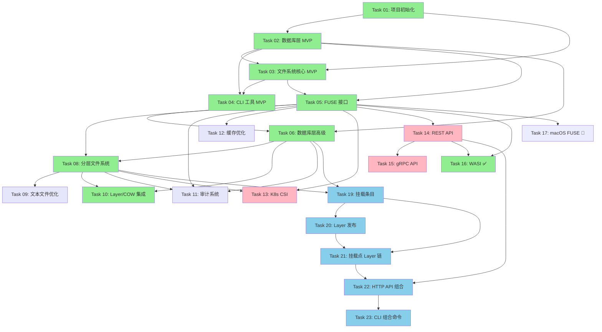

# Tarbox 开发任务

## 任务组织结构

本目录包含 Tarbox 项目的所有开发任务，按照实现阶段和优先级组织。

## 当前进度概览

```
MVP Phase (已完成)              ████████████████████ 100%
├─ Task 01: 项目初始化          ✅ 完成
├─ Task 02: 数据库层 MVP        ✅ 完成
├─ Task 03: 文件系统核心 MVP     ✅ 完成
└─ Task 04: CLI 工具 MVP        ✅ 完成

Phase 2: 核心功能 (已完成)      ████████████████████ 100%
├─ Task 05: FUSE 接口           ✅ 完成
├─ Task 06: 数据库层高级         ✅ 完成
└─ Task 08: 分层文件系统         ✅ 完成

Phase 3: 高级功能 (进行中)      ████████░░░░░░░░░░░░ 40%
├─ Task 09: 文本文件优化         📅 待开始
├─ Task 10: Layer/COW 集成      ✅ 完成
├─ Task 11: 审计系统            📅 待开始
└─ Task 12: 缓存优化            📅 待开始

Phase 4: 云原生 (进行中)        ████░░░░░░░░░░░░░░░░ 20%
├─ Task 13: Kubernetes CSI      📅 待开始
├─ Task 14: REST API            📅 待开始
├─ Task 15: gRPC API            📅 待开始
├─ Task 16: WASI 支持           ✅ 完成 (84% 覆盖率)
└─ Task 17: macOS FUSE 支持     🚫 阻塞 (需要 macOS 环境)

Phase 5: 文件系统组合 (计划中)  ░░░░░░░░░░░░░░░░░░░░ 0%
├─ Task 19: 挂载条目基础设施     📅 待开始 (spec/18)
├─ Task 20: Layer 发布机制      📅 待开始 (spec/18)
├─ Task 21: 挂载点级别 Layer 链  📅 待开始 (spec/18)
├─ Task 22: HTTP API 组合功能   📅 待开始 (spec/06)
└─ Task 23: CLI 组合命令        📅 待开始 (spec/06)
```

## 任务列表

### ✅ Phase 1: MVP (已完成)

#### Task 01: 项目初始化与基础设施 ✅
- **状态**: 完成
- **文件**: [01-project-setup.md](01-project-setup.md)
- **内容**:
  - Rust 2024 项目结构
  - 依赖管理 (Cargo)
  - CI/CD (GitHub Actions)
  - Docker 构建
  - 多架构支持
- **交付物**:
  - ✅ Cargo 项目结构
  - ✅ GitHub Actions workflows
  - ✅ Dockerfile 和 docker-compose.yml
  - ✅ 代码规范和 linting 配置

#### Task 02: 数据库存储层 (MVP) ✅
- **状态**: 完成
- **文件**: [02-database-layer-mvp.md](02-database-layer-mvp.md)
- **内容**:
  - PostgreSQL 连接池
  - 基础 schema (tenants, inodes, data_blocks)
  - CRUD 操作
  - 事务支持
- **交付物**:
  - ✅ `src/storage/` 模块
  - ✅ Migration files
  - ✅ 单元测试
  - ✅ 集成测试
- **测试覆盖率**: 35 个单元测试通过

#### Task 03: 文件系统核心 (MVP) ✅
- **状态**: 完成
- **文件**: [03-filesystem-core-mvp.md](03-filesystem-core-mvp.md)
- **内容**:
  - 路径解析和规范化
  - 目录操作 (create, list, remove)
  - 文件操作 (create, read, write, delete)
  - 元数据操作 (stat, chmod, chown)
- **交付物**:
  - ✅ `src/fs/` 模块
  - ✅ 路径验证 (4096 字节限制)
  - ✅ 错误处理
  - ✅ 20 个单元测试
- **测试覆盖率**: path.rs 87.88%, error.rs 100%

#### Task 04: CLI 工具 (MVP) ✅
- **状态**: 完成
- **文件**: [04-cli-tool.md](04-cli-tool.md)
- **内容**:
  - 租户管理命令
  - 文件系统操作命令
  - 数据库初始化
  - 配置管理
- **交付物**:
  - ✅ `src/main.rs` (完整 CLI)
  - ✅ clap-based 命令解析
  - ✅ 环境变量配置
  - ✅ 用户友好输出
- **可用命令**: init, tenant (create/info/list/delete), mkdir, ls, rmdir, touch, write, cat, rm, stat

---

### 📅 Phase 2: 核心功能增强

#### Task 05: FUSE 接口
- **状态**: 部分完成 (50%)
- **文件**: [05-fuse-interface.md](05-fuse-interface.md)
- **优先级**: P0 (高优先级)
- **依赖**: Task 02 ✅, Task 03 ✅
- **内容**:
  - ✅ FilesystemInterface 抽象层 (spec/14)
  - ✅ TarboxBackend 实现
  - ✅ 单元测试 (77个) 和集成测试 (30个)
  - ⏳ FuseAdapter 实现 (待完成)
  - ⏳ FUSE mount/unmount (待完成)
- **预计剩余工作量**: 1-2 周
- **关联 Spec**: **spec/14-filesystem-interface.md** (核心), spec/02-fuse-interface.md
- **⭐ 重要**: 90%代码可被CSI/WASI复用

#### Task 06: 数据库层高级功能
- **状态**: 计划中
- **文件**: [06-database-layer-advanced.md](06-database-layer-advanced.md)
- **优先级**: P1
- **依赖**: Task 02 ✅, Task 05
- **内容**:
  - Layer 表和操作（分层文件系统）
  - Text blocks 优化（文本文件存储）
  - 审计日志表（时间分区）
  - Native mounts 配置表（原生挂载）
  - 统计和快照表
- **预计工作量**: 2-3 周
- **关联 Spec**: **spec/16-advanced-storage.md** (核心), spec/03, spec/04, spec/10, spec/07

#### Task 08: 分层文件系统
- **状态**: 计划中
- **文件**: [08-layered-filesystem.md](08-layered-filesystem.md)
- **优先级**: P1
- **依赖**: Task 05, Task 07
- **内容**:
  - Layer 管理 (create, switch, list)
  - Copy-on-Write (COW)
  - 检查点和快照
  - 虚拟文件系统钩子 (/.tarbox/)
- **预计工作量**: 3-4 周
- **关联 Spec**: spec/04-layered-filesystem.md, spec/08-filesystem-hooks.md

---

### 🚀 Phase 3: 高级功能

#### Task 09: 文本文件优化
- **状态**: 计划中
- **优先级**: P2
- **依赖**: Task 08
- **内容**:
  - UTF-8 检测和验证
  - 行级存储和 diff
  - TextBlock 和 TextLineMap
  - 跨文件去重
- **预计工作量**: 3 周
- **关联 Spec**: spec/10-text-file-optimization.md

#### Task 10: 整合 Layer 和 COW 到 FileSystem ✅
- **状态**: 完成
- **文件**: [10-integrate-layer-cow-to-filesystem.md](10-integrate-layer-cow-to-filesystem.md)
- **优先级**: P1
- **依赖**: Task 06 ✅, Task 08 ✅
- **内容**:
  - ✅ Layer 和 COW 集成到 FileSystem
  - ✅ 文件类型检测（文本/二进制）
  - ✅ 虚拟文件系统钩子 (/.tarbox/)
  - ✅ Union view 跨层查询
  - ✅ 52 个新测试（370+ 总测试）
- **测试覆盖率**: 75.27%
- **关联 Spec**: spec/04, spec/08, spec/10

#### Task 11: 审计系统
- **状态**: 计划中
- **文件**: [11-audit-system.md](11-audit-system.md)
- **优先级**: P1
- **依赖**: Task 05 ✅, Task 06 ✅, Task 08 ✅
- **内容**:
  - 异步批量写入（队列 + 后台任务）
  - 审计级别控制（none/basic/standard/full/debug）
  - 采样策略（高频操作智能采样）
  - 文本文件变化追踪（行级 diff）
  - 查询接口增强（行为分析、聚合）
  - 实时流式审计
  - FUSE 层集成
  - CLI 审计工具
- **预计工作量**: 2-3 周
- **关联 Spec**: **spec/03-audit-system.md** (核心)

#### Task 12: 缓存优化
- **状态**: 计划中
- **优先级**: P2
- **依赖**: Task 05
- **内容**:
  - Inode 缓存 (LRU)
  - Block 缓存
  - 路径缓存
  - 缓存失效策略
- **预计工作量**: 1-2 周
- **关联 Spec**: spec/07-performance.md

---

### ☸️ Phase 4: 云原生集成

#### Task 13: Kubernetes CSI 驱动
- **状态**: 计划中
- **优先级**: P2
- **依赖**: Task 05 (FilesystemInterface), Task 08
- **内容**:
  - 实现 CsiAdapter (类似 FuseAdapter)
  - 复用 TarboxBackend (~90%代码)
  - CSI 规范实现
  - 动态卷配置
  - 快照支持
  - 多租户隔离
- **预计工作量**: 3-4 周 (减少1周，得益于代码复用)
- **关联 Spec**: **spec/14-filesystem-interface.md** (核心), spec/05-kubernetes-csi.md

#### Task 14: REST API
- **状态**: 计划中
- **优先级**: P2
- **依赖**: Task 05
- **内容**:
  - Axum 框架
  - 租户管理 API
  - 文件操作 API
  - 层管理 API
- **预计工作量**: 2-3 周
- **关联 Spec**: spec/06-api-design.md

#### Task 15: gRPC API
- **状态**: 计划中
- **优先级**: P2
- **依赖**: Task 14
- **内容**:
  - Tonic 框架
  - Protocol Buffers 定义
  - 流式传输支持
  - 性能优化
- **预计工作量**: 2 周
- **关联 Spec**: spec/06-api-design.md

#### Task 16: WASI 支持 ✅
- **状态**: 完成
- **文件**: [16-wasi-support.md](16-wasi-support.md)
- **优先级**: P2
- **依赖**: Task 05 (FilesystemInterface)
- **内容**:
  - ✅ WasiAdapter 实现
  - ✅ 文件描述符表 (FdTable)
  - ✅ 错误处理和 errno 映射
  - ✅ 配置管理 (HTTP/SQLite 模式)
  - ✅ 84.22% 测试覆盖率
- **交付物**:
  - ✅ `src/wasi/` 模块 (adapter, config, error, fd_table)
  - ✅ 70+ 单元测试
  - ✅ 9 个集成测试
- **关联 Spec**: spec/13-wasi-interface.md

#### Task 17: macOS FUSE 支持
- **状态**: 🚫 阻塞
- **文件**: [17-macos-fuse-support.md](17-macos-fuse-support.md)
- **优先级**: P3
- **依赖**: Task 05 (FUSE 接口)
- **阻塞原因**: 需要 macOS 开发/测试环境
- **内容**:
  - macFUSE 集成
  - 平台特定构建配置
  - macOS CI/CD 支持
- **预计工作量**: 1 周 (有 macOS 环境后)
- **备注**: v0.1.0 仅支持 Linux，macOS 支持计划在后续版本

---

### 🔗 Phase 5: 文件系统组合 (Filesystem Composition)

> 基于 spec/18 和 spec/06 的文件系统组合功能，支持多源挂载、Layer 发布、跨租户共享。

#### Task 19: 挂载条目基础设施
- **状态**: 计划中
- **文件**: [19-mount-entries-foundation.md](19-mount-entries-foundation.md)
- **优先级**: P1
- **依赖**: Task 02, Task 06, Task 08
- **内容**:
  - mount_entries 数据库表
  - MountSource/MountMode 数据结构
  - MountEntryRepository 实现
  - 路径解析器 (PathResolver)
  - 路径冲突检测
- **预计工作量**: 2-3 天
- **关联 Spec**: **spec/18-filesystem-composition.md**
- **交付物**:
  - `src/storage/models/mount_entry.rs`
  - `src/storage/mount_entry.rs`
  - `src/composition/resolver.rs`
  - 45+ 测试

#### Task 20: Layer 发布机制
- **状态**: 计划中
- **文件**: [20-layer-publishing.md](20-layer-publishing.md)
- **优先级**: P1
- **依赖**: Task 19, Task 08
- **内容**:
  - published_mounts 数据库表
  - PublishTarget (Layer/WorkingLayer)
  - PublishScope (Public/AllowList)
  - 访问控制检查
  - LayerPublisher 服务
- **预计工作量**: 2-3 天
- **关联 Spec**: **spec/18-filesystem-composition.md**
- **交付物**:
  - `src/storage/models/published_mount.rs`
  - `src/storage/published_mount.rs`
  - `src/composition/publisher.rs`
  - 45+ 测试

#### Task 21: 挂载点级别 Layer 链
- **状态**: 计划中
- **文件**: [21-mount-level-layer-chains.md](21-mount-level-layer-chains.md)
- **优先级**: P1
- **依赖**: Task 19, Task 20, Task 08
- **内容**:
  - 修改 layers 表（添加 mount_entry_id）
  - 每个 WorkingLayer 挂载点独立 layer 链
  - LayerChainManager 服务
  - Snapshot 单个/多个挂载点
  - 与 FileSystem 集成
- **预计工作量**: 3-4 天
- **关联 Spec**: **spec/18-filesystem-composition.md**
- **交付物**:
  - `src/composition/layer_chain.rs`
  - 更新 `src/storage/layer.rs`
  - 更新 `src/fs/operations.rs`
  - 40+ 测试

#### Task 22: HTTP API 组合功能
- **状态**: 计划中
- **文件**: [22-http-api-composition.md](22-http-api-composition.md)
- **优先级**: P1
- **依赖**: Task 19, Task 20, Task 21, Task 14
- **内容**:
  - 挂载管理 API (CRUD, import/export)
  - Snapshot API (单个/批量)
  - 发布 API (publish/unpublish)
  - 路径解析 API (调试)
  - DTO 和错误处理
- **预计工作量**: 3-4 天
- **关联 Spec**: **spec/06-api-design.md**
- **交付物**:
  - `src/api/routes/composition.rs`
  - `src/api/handlers/composition.rs`
  - `src/api/dto/composition.rs`
  - 45+ 测试

#### Task 23: CLI 组合命令
- **状态**: 计划中
- **文件**: [23-cli-composition-commands.md](23-cli-composition-commands.md)
- **优先级**: P1
- **依赖**: Task 19, Task 20, Task 21, Task 22
- **内容**:
  - mount 子命令 (apply/list/export/validate/clear/remove/enable/disable/update/resolve)
  - snapshot 命令 (单个/多个/全部)
  - publish 命令 (发布/取消发布/列出)
  - layer 发布管理命令
  - TOML 配置文件解析
- **预计工作量**: 2-3 天
- **关联 Spec**: **spec/06-api-design.md**
- **交付物**:
  - `src/cli/commands/mount.rs`
  - `src/cli/commands/snapshot.rs`
  - `src/cli/commands/publish.rs`
  - `src/cli/config/mount_config.rs`
  - 45+ 测试

---

## 任务依赖关系图



## 开发原则

### 质量标准
- **测试覆盖率**: > 80% (项目要求)
- **代码风格**: 遵循 Rust 2024 最佳实践
- **错误处理**: Fail-fast 原则，使用 `anyhow::Result`
- **文档**: 每个模块都有清晰的文档

### 工作流程
1. **规划**: 阅读对应的 spec 文档
2. **设计**: 在 task 文件中记录设计决策
3. **实现**: 编写代码，遵循 TDD
4. **测试**: 单元测试 + 集成测试
5. **审查**: 代码格式 + Clippy + 测试覆盖率
6. **文档**: 更新 task 文件状态

### Pre-commit 检查
```bash
cargo fmt --all && \
cargo clippy --all-targets --all-features -- -D warnings && \
cargo test
```

## 里程碑

- **M1** (✅ 完成): MVP 核心 - Task 01-04
  - 基础存储层
  - CLI 工具
  - 可通过命令行管理文件

- **M2** (✅ 完成): 核心功能 - Task 05-06, 08, 10
  - FUSE 接口完成
  - 数据库层高级功能
  - 分层文件系统实现
  - Layer/COW 集成到文件系统
  - 可作为真实分层文件系统使用
  - 370+ 测试，75.27% 覆盖率

- **M3** (进行中): 高级功能 - Task 09, 11-12
  - 文本文件优化
  - 审计系统 ⏳ 下一步
  - 缓存优化
  - 性能调优
  - 生产环境就绪

- **M4** (计划中): 云原生 - Task 13-16
  - Kubernetes CSI 驱动
  - REST/gRPC API 服务
  - WASI 支持
  - 云原生部署

- **M5** (计划中): 文件系统组合 - Task 19-23
  - 多源挂载 (Host/Layer/Published/WorkingLayer)
  - Layer 发布与访问控制
  - 挂载点级别 Layer 链
  - HTTP API 和 CLI 支持
  - 跨租户共享能力

## 相关文档

- **规范文档**: [../spec/](../spec/) - 架构设计和技术规范
- **开发指南**: [../CLAUDE.md](../CLAUDE.md) - 开发规范和原则
- **项目概览**: [../README.md](../README.md) - 项目介绍

## 更新日志

- 2026-01-29: 创建 Phase 5 文件系统组合任务 (Task 19-23)，基于 spec/18 和 spec/06
- 2026-01-22: 创建 Task 11 (审计系统)，更新任务编号和依赖关系
- 2026-01-22: Task 10 完成 (Layer/COW 集成)，M2 里程碑达成
- 2026-01-19: Task 08 完成 (分层文件系统)，370+ 测试，75.27% 覆盖率
- 2026-01-19: Task 06 完成 (数据库层高级功能)
- 2026-01-18: Task 05 完成 (FUSE 接口)
- 2026-01-17: 重组任务结构，更新进度状态
- 2026-01-16: Task 04 完成，MVP 交付
- 2026-01-16: Task 03 完成
- 2026-01-16: Task 02 完成
- 2026-01-15: Task 01 完成
