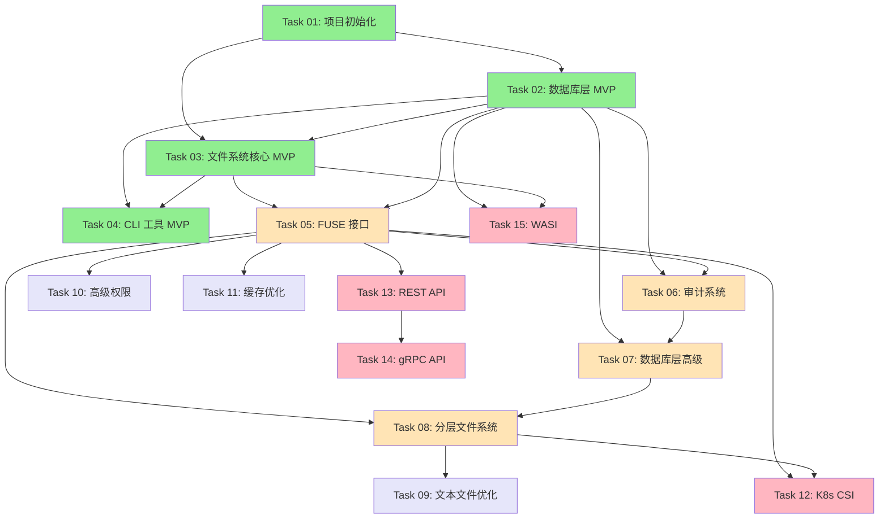

# Tarbox 开发任务

## 任务组织结构

本目录包含 Tarbox 项目的所有开发任务，按照实现阶段和优先级组织。

## 当前进度概览

```
MVP Phase (已完成)           ████████████████████ 100%
├─ Task 01: 项目初始化       ✅ 完成
├─ Task 02: 数据库层 MVP     ✅ 完成
├─ Task 03: 文件系统核心 MVP  ✅ 完成
└─ Task 04: CLI 工具 MVP     ✅ 完成

Phase 2: 核心功能 (计划中)   ░░░░░░░░░░░░░░░░░░░░ 0%
├─ Task 05: FUSE 接口        📅 待开始
├─ Task 06: 审计系统         📅 待开始
└─ Task 08: 分层文件系统     📅 待开始

Phase 3: 高级功能 (计划中)   ░░░░░░░░░░░░░░░░░░░░ 0%
├─ Task 09: 文本文件优化     📅 待开始
├─ Task 10: 高级权限系统     📅 待开始
└─ Task 11: 缓存优化         📅 待开始

Phase 4: 云原生 (计划中)     ░░░░░░░░░░░░░░░░░░░░ 0%
├─ Task 12: Kubernetes CSI   📅 待开始
├─ Task 13: REST API         📅 待开始
├─ Task 14: gRPC API         📅 待开始
└─ Task 15: WASI 支持        📅 待开始
```

## 任务列表

### ✅ Phase 1: MVP (已完成)

#### Task 01: 项目初始化与基础设施 ✅
- **状态**: 完成
- **文件**: [01-project-setup.md](01-project-setup.md)
- **内容**:
  - Rust 2024 项目结构
  - 依赖管理 (Cargo)
  - CI/CD (GitHub Actions)
  - Docker 构建
  - 多架构支持
- **交付物**:
  - ✅ Cargo 项目结构
  - ✅ GitHub Actions workflows
  - ✅ Dockerfile 和 docker-compose.yml
  - ✅ 代码规范和 linting 配置

#### Task 02: 数据库存储层 (MVP) ✅
- **状态**: 完成
- **文件**: [02-database-layer-mvp.md](02-database-layer-mvp.md)
- **内容**:
  - PostgreSQL 连接池
  - 基础 schema (tenants, inodes, data_blocks)
  - CRUD 操作
  - 事务支持
- **交付物**:
  - ✅ `src/storage/` 模块
  - ✅ Migration files
  - ✅ 单元测试
  - ✅ 集成测试
- **测试覆盖率**: 35 个单元测试通过

#### Task 03: 文件系统核心 (MVP) ✅
- **状态**: 完成
- **文件**: [03-filesystem-core-mvp.md](03-filesystem-core-mvp.md)
- **内容**:
  - 路径解析和规范化
  - 目录操作 (create, list, remove)
  - 文件操作 (create, read, write, delete)
  - 元数据操作 (stat, chmod, chown)
- **交付物**:
  - ✅ `src/fs/` 模块
  - ✅ 路径验证 (4096 字节限制)
  - ✅ 错误处理
  - ✅ 20 个单元测试
- **测试覆盖率**: path.rs 87.88%, error.rs 100%

#### Task 04: CLI 工具 (MVP) ✅
- **状态**: 完成
- **文件**: [04-cli-tool.md](04-cli-tool.md)
- **内容**:
  - 租户管理命令
  - 文件系统操作命令
  - 数据库初始化
  - 配置管理
- **交付物**:
  - ✅ `src/main.rs` (完整 CLI)
  - ✅ clap-based 命令解析
  - ✅ 环境变量配置
  - ✅ 用户友好输出
- **可用命令**: init, tenant (create/info/list/delete), mkdir, ls, rmdir, touch, write, cat, rm, stat

---

### 📅 Phase 2: 核心功能增强

#### Task 05: FUSE 接口
- **状态**: 计划中
- **文件**: [05-fuse-interface.md](05-fuse-interface.md)
- **优先级**: P0 (高优先级)
- **依赖**: Task 02, Task 03
- **内容**:
  - FUSE 3 接口实现
  - POSIX 系统调用映射
  - 异步到同步桥接
  - 挂载点管理
- **预计工作量**: 2-3 周
- **关联 Spec**: spec/02-fuse-interface.md

#### Task 06: 审计系统
- **状态**: 计划中
- **文件**: [06-audit-system.md](06-audit-system.md) (需创建)
- **优先级**: P1
- **依赖**: Task 02, Task 05
- **内容**:
  - 审计日志表设计
  - 异步批量插入
  - 时间分区表
  - 审计查询 API
- **预计工作量**: 2 周
- **关联 Spec**: spec/03-audit-system.md

#### Task 07: 数据库层高级功能
- **状态**: 计划中 (已有部分文件)
- **文件**: [06-database-layer-advanced.md](06-database-layer-advanced.md)
- **优先级**: P1
- **依赖**: Task 02, Task 06
- **内容**:
  - Layer 表和操作
  - Text blocks 优化
  - 审计日志表
  - 性能优化
- **预计工作量**: 2 周
- **关联 Spec**: spec/01-database-schema.md

#### Task 08: 分层文件系统
- **状态**: 计划中
- **文件**: [08-layered-filesystem.md](08-layered-filesystem.md)
- **优先级**: P1
- **依赖**: Task 05, Task 07
- **内容**:
  - Layer 管理 (create, switch, list)
  - Copy-on-Write (COW)
  - 检查点和快照
  - 虚拟文件系统钩子 (/.tarbox/)
- **预计工作量**: 3-4 周
- **关联 Spec**: spec/04-layered-filesystem.md, spec/08-filesystem-hooks.md

---

### 🚀 Phase 3: 高级功能

#### Task 09: 文本文件优化
- **状态**: 计划中
- **优先级**: P2
- **依赖**: Task 08
- **内容**:
  - UTF-8 检测和验证
  - 行级存储和 diff
  - TextBlock 和 TextLineMap
  - 跨文件去重
- **预计工作量**: 3 周
- **关联 Spec**: spec/10-text-file-optimization.md

#### Task 10: 高级权限系统
- **状态**: 计划中
- **文件**: [07-filesystem-core-advanced.md](07-filesystem-core-advanced.md)
- **优先级**: P2
- **依赖**: Task 05
- **内容**:
  - 完整 POSIX 权限
  - ACL 支持
  - 符号链接和硬链接
  - 扩展属性 (xattr)
- **预计工作量**: 2 周

#### Task 11: 缓存优化
- **状态**: 计划中
- **优先级**: P2
- **依赖**: Task 05
- **内容**:
  - Inode 缓存 (LRU)
  - Block 缓存
  - 路径缓存
  - 缓存失效策略
- **预计工作量**: 1-2 周
- **关联 Spec**: spec/07-performance.md

---

### ☸️ Phase 4: 云原生集成

#### Task 12: Kubernetes CSI 驱动
- **状态**: 计划中
- **优先级**: P2
- **依赖**: Task 05, Task 08
- **内容**:
  - CSI 规范实现
  - 动态卷配置
  - 快照支持
  - 多租户隔离
- **预计工作量**: 4-5 周
- **关联 Spec**: spec/05-kubernetes-csi.md

#### Task 13: REST API
- **状态**: 计划中
- **优先级**: P2
- **依赖**: Task 05
- **内容**:
  - Axum 框架
  - 租户管理 API
  - 文件操作 API
  - 层管理 API
- **预计工作量**: 2-3 周
- **关联 Spec**: spec/06-api-design.md

#### Task 14: gRPC API
- **状态**: 计划中
- **优先级**: P2
- **依赖**: Task 13
- **内容**:
  - Tonic 框架
  - Protocol Buffers 定义
  - 流式传输支持
  - 性能优化
- **预计工作量**: 2 周
- **关联 Spec**: spec/06-api-design.md

#### Task 15: WASI 支持
- **状态**: 计划中
- **优先级**: P2
- **依赖**: Task 02, Task 03
- **内容**:
  - wasm32-wasi target 支持
  - WASI filesystem 接口实现
  - HTTP database client
  - SQLite 嵌入式模式
- **预计工作量**: 8-12 周
- **关联 Spec**: spec/13-wasi-interface.md

---

## 任务依赖关系图



## 开发原则

### 质量标准
- **测试覆盖率**: > 80% (项目要求)
- **代码风格**: 遵循 Rust 2024 最佳实践
- **错误处理**: Fail-fast 原则，使用 `anyhow::Result`
- **文档**: 每个模块都有清晰的文档

### 工作流程
1. **规划**: 阅读对应的 spec 文档
2. **设计**: 在 task 文件中记录设计决策
3. **实现**: 编写代码，遵循 TDD
4. **测试**: 单元测试 + 集成测试
5. **审查**: 代码格式 + Clippy + 测试覆盖率
6. **文档**: 更新 task 文件状态

### Pre-commit 检查
```bash
cargo fmt --all && \
cargo clippy --all-targets --all-features -- -D warnings && \
cargo test
```

## 里程碑

- **M1** (✅ 完成): MVP 核心 - Task 01-04
  - 基础存储层
  - CLI 工具
  - 可通过命令行管理文件

- **M2** (计划中): 核心功能 - Task 05-08
  - FUSE 挂载
  - 审计系统
  - 分层文件系统
  - 可作为真实文件系统使用

- **M3** (计划中): 高级功能 - Task 09-11
  - 文本优化
  - 完整权限
  - 性能优化
  - 生产环境就绪

- **M4** (计划中): 云原生 - Task 12-15
  - Kubernetes 集成
  - API 服务
  - WASI 支持
  - 云原生部署

## 相关文档

- **规范文档**: [../spec/](../spec/) - 架构设计和技术规范
- **开发指南**: [../CLAUDE.md](../CLAUDE.md) - 开发规范和原则
- **项目概览**: [../README.md](../README.md) - 项目介绍

## 更新日志

- 2026-01-17: 重组任务结构，更新进度状态
- 2026-01-16: Task 04 完成，MVP 交付
- 2026-01-16: Task 03 完成
- 2026-01-16: Task 02 完成
- 2026-01-15: Task 01 完成
